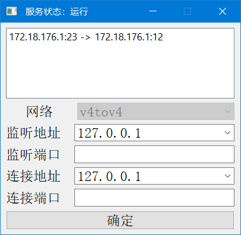
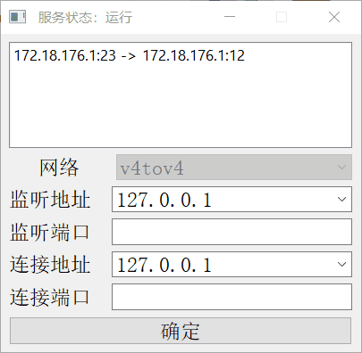
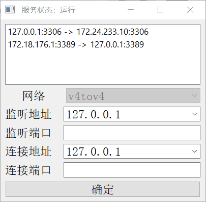
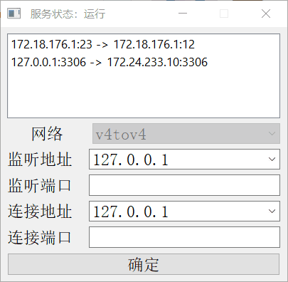

## Windows端口转发命令的GUI版本

### 简介

port_proxy_gui 为 Windows 端口转发的 GUI 版本，为了解决每次需要用到 Windows 端口转发时需要敲很长的命令的问题。

工具界面使用 Python 和 PySide2 编写，Python 版本为 3.8.6，可以跨平台运行，但是由于所使用的端口转发命令仅限于 Windows，所以在其他平台运行没有意义。😂😂

工具所使用到的依赖为：

| 依赖        | 版本号 |
| ----------- | ------ |
| PySide2     | 5.15.2 |
| netifaces   | 0.10.9 |
| pyinstaller | 4.1    |

工具主界面长这样：

### 软件原理

依赖于 Windows 的 IP Helper 服务，在启动时软件会自动检测服务状态， **IP Helper 服务状态显示在标题上**，如未开启对应服务，请自行开启。

通过 `netsh interface portproxy` 命令设置和删除端口转发规则，`netsh interface portproxy` 命令要求使用管理员权限运行，所以本工具也要使用管理员权限运行。

### 安装

配置好 Python 环境，使用以下命令安装依赖（使用管理员权限运行）：

`pip install -r requirements.txt`

如果遇到编译错误则需要去 [https://www.lfd.uci.edu/~gohlke/pythonlibs/#netifaces](https://www.lfd.uci.edu/~gohlke/pythonlibs/#netifaces)
根据自己的 Python 版本下载编译好的 whl 文件。

全部依赖安装好后双击 build.bat 编译 exe 文件。

结束。

### 注意

**目前仅支持 IPv4 的端口转发功能，因为目前没有 IPv6 测试环境，并且 IPv6 很少使用到，所以暂不支持 IPv6 的端口转发，如有需要的小伙伴欢迎 PR。**

### 使用

#### 添加新的端口转发规则

#### 修改之前的端口转发规则

首先双击需要修改的端口转发规则，然后再下方的文本框中修改对应的端口和地址，点击确定提交修改。

#### 删除端口转发规则

在需要删除的端口转发规则上右键点击删除即可删除对应规则。

